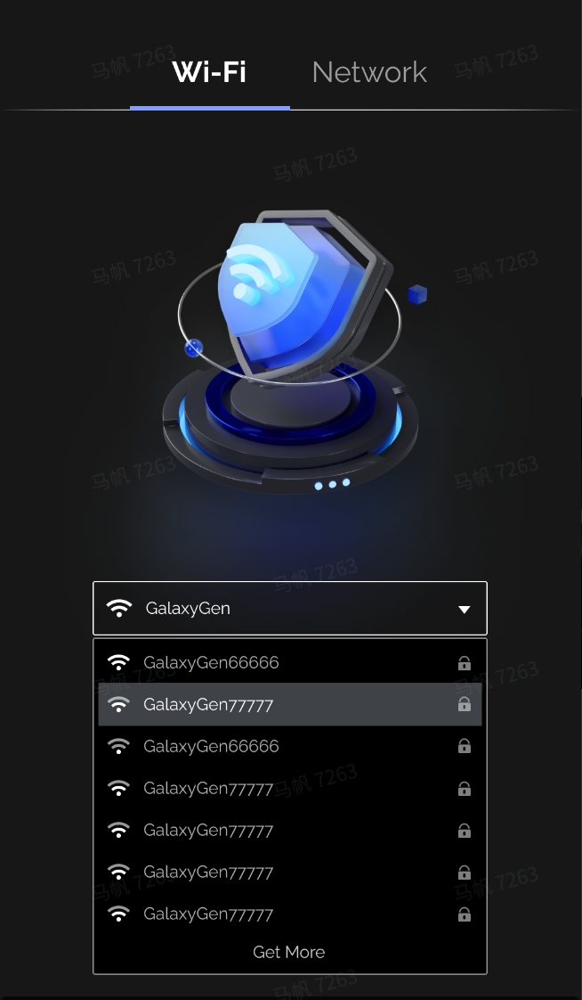
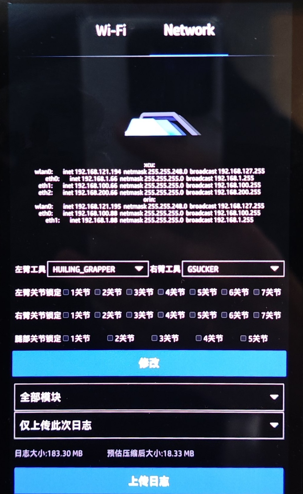
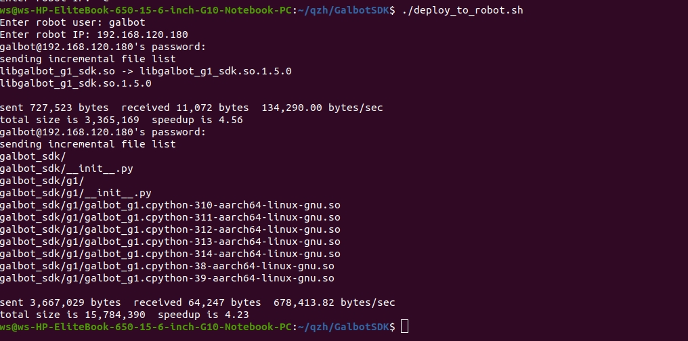
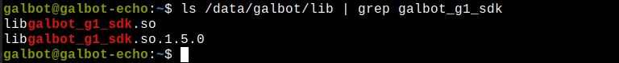
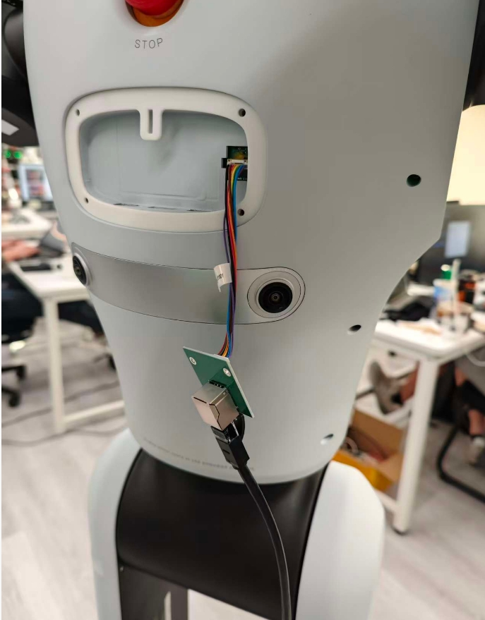
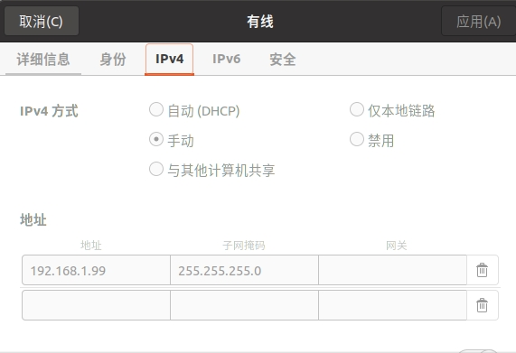
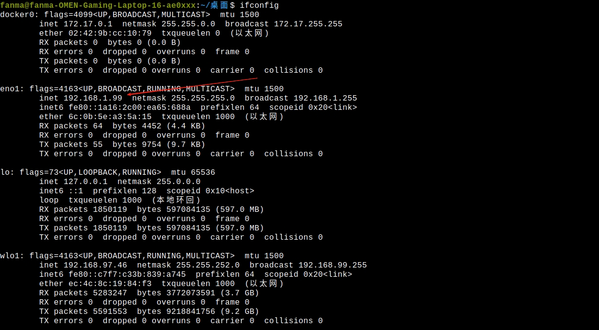
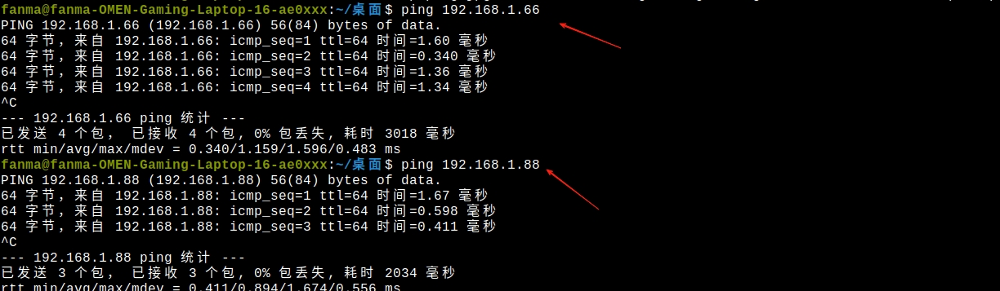

# Installation and Configuration

## System Requirements

| Component | Recommended | Support Range |
|------|------|----------|
| **Operating System** | Ubuntu 22.04 | Ubuntu 20.04 - 24.04 |
| **Architecture (PC)** | x86_64 | x86_64 |
| **Architecture (Robot)** | aarch64 | aarch64 |
| **Python** | 3.8+ | 3.8 - 3.14 |
| **Storage Space** | 16GB | 3GB+ |

---

## Mode 1: Robot-Side Deployment

**Use Case:** Production environment deployment, applications requiring high real-time performance

**Features:** No network latency, minimal communication overhead

### 1. Connect to Robot Network

1.1 After powering on, connect to WiFi in the network selection interface




1.2 Check the robot's IP address in the Network interface



### 2. Deploy SDK to Robot

2.1 Execute the deployment script on PC

```bash
cd GalbotSDK
./deploy_to_robot.sh
```

2.2 Enter connection information as prompted

- Username: `galbot`
- Orin IP address: e.g., `192.168.120.180` 
- Password: `gb@2023`



!!! success "Deployment Result"
    Dynamic library automatically installed to: `/data/galbot/lib`

2.3 Verify installation

```bash
ssh galbot@<Robot IP>
ls /data/galbot/lib | grep galbot_sdk
```
!!! success "Expected Output"
    Displays libgalbot_sdk.so and libgalbot_sdk.so.1.7.0



### 3. Install SDK on PC

Navigate to the SDK directory and execute the installation script
```bash
cd GalbotSDK
sudo ./install.sh
```

### 4. Compile Programs

4.1 Cross-compile on PC (aarch64)

```bash
cd examples/cpp/
mkdir -p build
cd build
cmake ../ -DCMAKE_TOOLCHAIN_FILE=../cmake/linux-aarch64-gcc940.cmake
make
```

4.2 Transfer the executable file to the robot's Orin

```bash
scp your_app galbot@<Robot IP>:/userdata
```

### 5. Run Programs

5.1 C++ Programs

```bash
ssh galbot@<Robot IP>
cd /userdata
./your_app
```

5.2 Python Programs

```bash
export PYTHONPATH=/data/galbot/lib:$PYTHONPATH
python your_app.py
```

!!! tip "Persist Environment Variables"
    ```bash
    echo 'export PYTHONPATH=/data/galbot/lib:$PYTHONPATH' >> ~/.bashrc
    source ~/.bashrc
    ```

---

## Mode 2: PC-Side Deployment

**Use Case:** Development and debugging, rapid iteration

**Features:** Convenient development, supports LAN remote control

### 1. Physical Connection

Connect PC and robot using an Ethernet cable



### 2. Network Configuration

#### 2.1 Configure PC Network Interface IP

- IP Address: `192.168.1.99` (or other address in the same subnet)
- Subnet Mask: `255.255.255.0`

Ubuntu Settings Path: **Settings → Network → Wired Settings → IPv4 → Manual**



Verify configuration:

```bash
ifconfig
```

!!! success "Expected Output"
    Displays `inet 192.168.1.99`



#### 2.2 Configure PC IP Configuration File

File path: `/data/config/embosa_ip_config.json`

Configuration example (assuming PC: 192.168.1.99, XCU: 192.168.1.66, Orin: 192.168.1.88):

```json
{
    "embosa_ip": {
        "local_interface": [
            "192.168.1.99"
        ],
        "peer_lists": [
            "192.168.1.66",
            "192.168.1.88"
        ]
    }
}
```

#### 2.3 Configure Orin IP Configuration File

!!! warning "Prerequisites"
    You must first connect to Orin via WiFi, refer to Mode 1 Step 1

2.3.1 Login to Orin

```bash
ssh galbot@<Orin Wireless IP>
# Password: gb@2023
```

2.3.2 Edit configuration file

```bash
vi /data/config/embosa_ip_config.json
```

2.3.3 Configuration content

!!! danger "Important"
    `192.168.100.88` and `192.168.100.66` are internal direct connection IPs between Orin and XCU, must be retained

```json
{
    "embosa_ip": {
        "local_interface": [
            "192.168.100.88",
            "192.168.1.88"
        ],
        "peer_lists": [
            "192.168.100.66",
            "192.168.1.99"
        ]
    }
}
```

#### 2.4 Configure XCU IP Configuration File

2.4.1 Login to XCU

```bash
ssh root@<XCU Wireless IP>
# Password: 12345678
```

2.4.2 Edit configuration file

```bash
vi /data/config/embosa_ip_config.json
```

2.4.3 Configuration content

```json
{
    "embosa_ip": {
        "local_interface": [
            "192.168.100.66",
            "192.168.1.66"
        ],
        "peer_lists": [
            "192.168.100.88",
            "192.168.1.99"
        ]
    }
}
```

#### 2.5 Verify Network Connection

!!! warning "Required Action"
    You must restart the robot after modifying the configuration

Test connection after restart:

```bash
ping 192.168.1.66  # Test XCU
ping 192.168.1.88  # Test Orin
```

!!! success "Expected Result"
    Normal ping response returned



### 3. Install SDK on PC

Navigate to the SDK directory and execute the installation script
```bash
cd GalbotSDK
sudo ./install.sh
```

### 4. Compile Programs

Compile on PC (x86_64)

```bash
cd examples/cpp/
mkdir -p build
cd build
cmake ../ -DCMAKE_TOOLCHAIN_FILE=../cmake/linux-x86_64-gcc940.cmake
make
```

### 5. Run Programs

5.1 Configure environment variables

!!! tip "Path Description"
    /opt/galbot/ is the default installation path, can be modified according to your installation path

```bash
source /opt/galbot/galbot_sdk/linux-x86_64-gcc940/setup.sh
```

!!! tip "Persist Environment Variables"
    ```bash
    echo 'source /opt/galbot/galbot_sdk/linux-x86_64-gcc940/setup.sh' >> ~/.bashrc
    source ~/.bashrc
    ```

---

5.2 Run C++ Programs

```bash
cd /userdata  # or the directory where your program is located
./your_app
```

5.3 Run Python Programs

```bash
python your_app.py
```

!!! tip "Python Dependency Installation"

    Some Python examples depend on additional libraries. Before running the Python examples, please execute the following script to ensure all required dependencies are installed:

    ```bash
    cd GalbotSDK
    ./install_python_deps.sh
    ```

---

## Terminology

After completing the configuration, you can start exploring the robot's examples and APIs. Before using the SDK, if you are not familiar with robotics terminology, refer to the following sections.

### 1. Robot Hardware

Physical components and hardware concepts of the robot.

| Term | Description |
|------|-------------|
| **XCU** | X Computing Unit. The base computing unit of the robot ("cerebellum"), responsible for low-level motor control, motion control, and other real-time tasks |
| **HPU / Orin** | High-Performance Unit / NVIDIA Jetson Orin. The high-performance computing unit ("brain"), responsible for image processing, AI inference, motion planning, and other compute-intensive tasks |
| **Base** | The robot's chassis, containing mobile wheels and power system |
| **Torso** | The main body of the robot, connecting the head, arms, and base |
| **Head** | The robot's head |
| **Arm** | The robot's arm, composed of multiple links and joints, e.g., `left_arm`, `right_arm` |
| **Leg** | The robot's leg structure, used for supporting vertical body movement and waist rotation |
| **Joint** | The movable part connecting two links, driven by a motor |
| **Link** | The rigid component connecting two joints |
| **Joint Group** | A collection of related joints, e.g., `left_arm` contains all joints of the left arm, used for coordinated control |
| **End-Effector** | The tool at the end of the robotic arm, such as a **Gripper** or **Suction Cup** |
| **DOF** | Degrees of Freedom. Describes the number of independently movable directions of a joint. For example, an arm has 7-DOF |
| **TCP** | Tool Center Point. The working point of the end-effector tool, such as the center of a gripper, used for precise control of the operating position |
| **Sensor** | Devices for perceiving the environment, including cameras, LiDAR, IMU, force sensors, etc. |
| **RGB Camera** | Color camera that captures visible light images |
| **Depth Camera** | Camera that outputs depth maps (distance per pixel), used for 3D perception |
| **LiDAR** | Light Detection and Ranging. Generates point cloud maps of the surrounding environment through laser ranging |
| **IMU** | Inertial Measurement Unit. Contains accelerometers and gyroscopes, measuring the robot's acceleration, angular velocity, and orientation |
| **Point Cloud** | A collection of numerous points in 3D space, each with `(x, y, z)` coordinates, generated by LiDAR or depth cameras |

### 2. Robotics Fundamentals

Core theoretical concepts describing robot motion and spatial relationships.

| Term | Description |
|------|-------------|
| **Frame** | Reference Frame. A coordinate system used to describe position and orientation. Think of it as a "ruler" fixed at a specific location in space |
| **World Frame** | The globally fixed coordinate system, typically based on the map origin or initial position |
| **Base Frame** | A coordinate system fixed to the robot's base, moving as the robot moves |
| **End-Effector Frame** | A coordinate system fixed to the end of the robotic arm, moving with the arm |
| **Joint Space** | The space defined by the angles of each joint. This is the robot's "native" control method |
| **Cartesian Space** | The 3D space described using `(x, y, z)` coordinates. A more intuitive way for humans to understand |
| **Pose** | Position + Orientation. A complete description of "where" something is + "which way" it faces |
| **Position** | The coordinates `(x, y, z)` of an object in 3D space, typically in meters (m) |
| **Orientation** | The rotational state of an object, describing which direction it faces |
| **Quaternion** | Represents rotation using 4 numbers `(qx, qy, qz, qw)`. Avoids gimbal lock issues, suitable for computer processing |
| **Euler Angles** | Represents rotation using three angles `(roll, pitch, yaw)`. More intuitive for human understanding |
| **FK** | Forward Kinematics. Given joint angles, calculate the end-effector pose ("where is the hand?") — has a unique solution |
| **IK** | Inverse Kinematics. Given a target pose, calculate the required joint angles ("how should joints rotate to reach there?") — may have multiple solutions or no solution |
| **Trajectory** | The complete motion path of the robot from start to end, including position, velocity, and acceleration at each moment |
| **Waypoint** | A key node in a trajectory. The robot passes through these points in sequence, similar to "via points" in navigation |
| **Interpolation** | Calculating smooth transitions between waypoints to generate continuous motion trajectories |
| **SLAM** | Simultaneous Localization and Mapping. The robot builds a map while moving and simultaneously determines its position within the map |
| **Self-Collision** | Collision between different parts of the robot, e.g., the left hand hitting the right hand |
| **Environment Collision** | Collision between the robot and surrounding obstacles |

### 3. Control and Interface

Common parameters and concepts used in the SDK.

| Term | Description |
|------|-------------|
| **SDK** | Software Development Kit. A software development toolkit containing libraries, tools, and documentation |
| **API** | Application Programming Interface. Defines the rules for interaction between programs |
| **SSH** | Secure Shell. A remote login protocol for connecting from a PC to the robot |
| **Cross Compilation** | Compiling programs on a PC (x86) that can run on the robot (ARM) |
| **Singleton** | A design pattern ensuring only one robot instance exists globally, obtained via `get_instance()` |
| **Blocking** | `is_blocking=True`. The function call waits for the operation to complete before returning. For example: `navigate_to_goal(..., is_blocking=True)` waits for navigation to finish, during which no other operations can be performed |
| **Non-blocking** | `is_blocking=False`. The function call returns immediately without waiting. For example: `navigate_to_goal(..., is_blocking=False)` returns immediately, and you can query status via functions like `is_localized()` |
| **base_pose** | `base_pose: [x, y, yaw]`. The robot base pose, containing `(x, y)` position (meters) and `yaw` yaw angle (radians) |
| **frame_id** | Target coordinate frame ID. Possible values: `"base_link"` (robot base), `"odom"` (odometry), `"map"` (map) |
| **reference_frame_id** | Reference coordinate frame ID, specifying which coordinate system a pose belongs to |
| **goal_pose** | `goal_pose: [x, y, z, qx, qy, qz, qw]`. Target pose, containing position `(x, y, z)` (meters) and quaternion `(qx, qy, qz, qw)` for orientation |
| **start_pose** | Starting pose, same format as `goal_pose` |
| **init_pose** | Initial pose estimate, used for relocalization |
| **reference_frame** | Relative coordinate frame name, e.g., `"base_link"`, `"world"`, or a kinematic chain name |
| **target_frame** | Target coordinate frame, used for coordinate transformations |
| **base_link** | The robot base coordinate frame. All arms, head, and other components reference this frame |
| **odom** | Odometry coordinate frame. Relative pose estimate based on wheel encoders |
| **map** | Map coordinate frame. The globally consistent coordinate frame established by SLAM |
| **joint_groups** | A list of joint group names, e.g., `["left_arm", "right_arm", "chassis"]` |
| **joint_names** | A list of specific joint names. Takes priority over `joint_groups`, e.g., `["left_arm_j1", "left_arm_j2"]` |
| **joint_positions** | An array of joint positions (radians), in the same order as returned by `get_joint_names()` |
| **waypoints** | A list of trajectory waypoints, each containing a target position and arrival time |
| **time_from_start_s** | Time from the trajectory start to this waypoint (seconds), used to control motion pacing |
| **timeout_s** | Timeout duration (seconds). The maximum time to wait for an operation to complete in blocking mode |
| **timestamp_ns** | Nanosecond-level timestamp, used for data synchronization |
| **safe_margin** | Collision detection safety distance (meters). For example, `0.1` means maintaining 10cm from obstacles |
| **enable_collision_check** | Whether to enable collision detection. `True` means enabled |
| **obstacle_id** | Unique identifier for an obstacle, used when adding/removing obstacles |
| **ignore_collision_link_names** | A list of link names to ignore during collision detection |
| **pose** | Pose data, an array of length 7: `[x, y, z, qx, qy, qz, qw]` |
| **reference_base_pose** | The robot base pose in the map coordinate frame |
| **linear_velocity** | `linear_velocity: [vx, vy, vz]`. Linear velocity array (m/s). `vx` is forward velocity, `vy` is lateral velocity, `vz` is vertical velocity |
| **angular_velocity** | `angular_velocity: [wx, wy, wz]`. Angular velocity array (rad/s). `wz` is yaw angular velocity |
| **status_string** | Status description string, e.g., `"SUCCESS"`, `"FAIL"`, `"TIMEOUT"`, `"MOVING"` |
| **is_localized** | `is_localized()`. A navigation status check function. Returns `True` if the robot is localized in the map |
| **get_frame_names()** | `get_frame_names()`. Returns a list of all available coordinate frame names |
| **quaternion** | `[qx, qy, qz, qw]`. Represents rotation as a quaternion. A unit quaternion satisfies `sqrt(qx²+qy²+qz²+qw²) = 1` |
| **euler** | `[roll, pitch, yaw]`. Represents rotation as Euler angles, in radians, in roll-pitch-yaw order |

