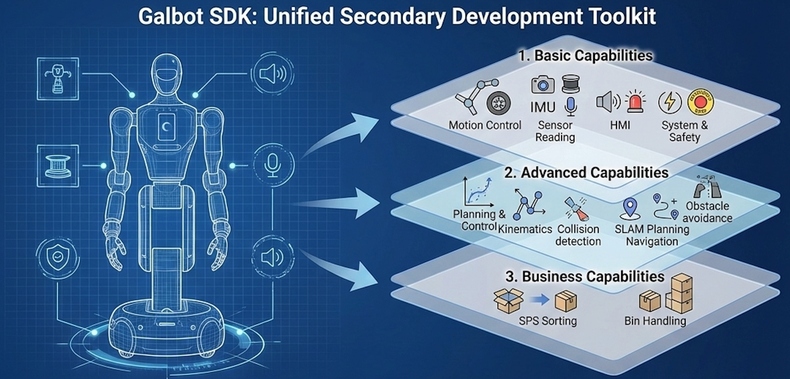
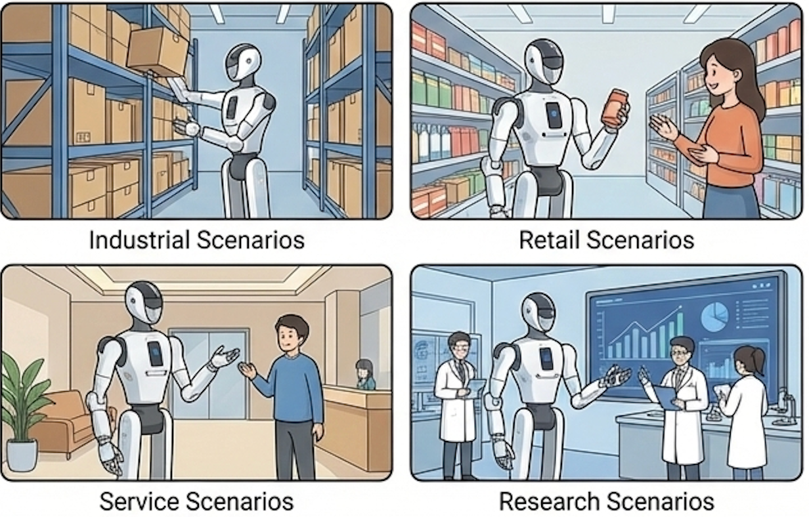
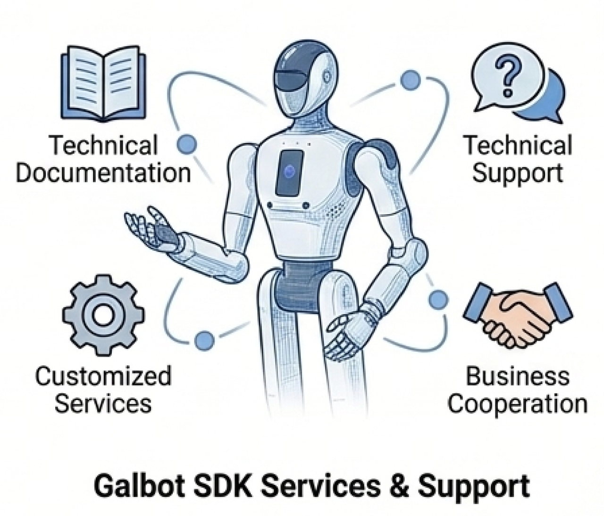

# Product Overview

Galbot SDK is a unified secondary development toolkit specifically designed for the Galbot series robot platform. By encapsulating underlying hardware communication and algorithm details, it provides atomic-level control and perception capabilities, as well as optional business-level functionalities. Suitable for scenarios such as industrial and retail integration, academic research, it helps developers quickly implement motion control, perceptual interaction, and autonomous navigation through concise APIs.

## Core Features

Galbot SDK adopts a layered decoupled design, dividing robot capabilities into three core layers, covering full-scenario development needs from low-level control to high-level business logic.

### 1. Basic Capabilities

Provides direct hardware control and raw data access capabilities for robot manipulation and sensor data acquisition.

- **Motion Control**: Supports joint space position/trajectory control, end-effector Cartesian space pose/trajectory control, as well as open-loop velocity control and emergency stop for the chassis.
- **Sensor Reading**: Provides comprehensive environmental perception data including color/depth visual streams, lidar point clouds, IMU inertial data, force sensors, and ultrasonic sensors.
- **Human-Robot Interaction**: Includes microphone stream acquisition, audio playback control, and RGB indicator light effect settings.
- **System and Safety**: Supports power/log system monitoring, software emergency stop mechanism, collision protection parameter configuration, and real-time resource destruction management.

### 2. Advanced Capabilities

Provides access to built-in algorithm services, supporting custom algorithm inference and execution. Developers can use built-in algorithm services according to their needs or design their own algorithms.

- **Planning and Control Interface**
    - Real-time Control: Exposes high-frequency real-time joint/end-effector command interfaces, supporting custom closed-loop control algorithms and inference execution for VLA, RL, etc.
    - Forward and Inverse Kinematics: Provides forward kinematics and inverse kinematics calculation interfaces with constraint optimization support.
    - Motion Planning: Supports single-chain and full-body multi-chain planning, single-waypoint trajectories and multi-waypoint continuous trajectory generation, with self-collision and environment collision detection capabilities.
    - Environment Management: Supports dynamic addition/removal of obstacles, as well as attachment of end-effector tools and target objects.
- **Navigation Interface**
    - Autonomous Navigation: Features SLAM mapping and localization, global/local path planning, and dynamic obstacle avoidance capabilities, supporting precise navigation task issuance and status monitoring.

### 3. Business Capabilities

Provides scenario-based business logic encapsulation, including capabilities for business scenarios such as bin handling and SPS sorting. Users can configure parameters and modify processes according to actual scenarios to quickly implement specific business functions. This capability requires business contact for unlocking.

- **SPS Sorting Module**: Automated pick and place logic for sorting scenarios.
- **Bin Handling Module**: Rapid implementation of bin identification, stacking, and handling processes.
- **More business modules are under continuous development.**

## Application Scenarios

Galbot SDK can be applied to the following scenarios according to user needs, including but not limited to:

- Industrial Scenarios: Material handling and sorting, intelligent warehousing management
- Retail Scenarios: Product sorting and delivery
- Service Scenarios: Reception and guidance services
- Research Scenarios: Robotics algorithm research, human-robot interaction experiments

## Services and Support

Galbot SDK provides the following services and support:

- Technical Documentation: API reference, development examples, and best practices
- Technical Support: Technical consultation and Q&A groups
- Custom Services: According to customer needs, providing SDK usage training and development guidance, business capability module authorization. Please contact business for details

---

## Reading Guide

This documentation uses Galbot-specific hardware terminology (e.g., HPU, XCU) as well as general robotics terminology (e.g., Frame, IK/FK). If you are new to robotics development, it is recommended to first complete the deployment in the **[Installation and Configuration](installation_and_configuration.md)** section, then refer to the **Terminology** section at the end of that document to familiarize yourself with the relevant terms before starting actual development.

