# Routine Operations

This document describes routine operations that may be performed during the operation of the Galbot robot to ensure all functions work properly.

---

## Map Engine - Mapping & Localization

The map engine is the core foundation of the navigation function. It is not an optional add-on, **but a mandatory prerequisite for navigation**. Before using the navigation function, you must complete mapping and ensure localization is running properly. Failure to complete mapping and localization correctly will result in the navigation function not working.

---

### Mapping Process

Mapping is a prerequisite for navigation. You must complete the construction of an environment map before using the navigation function.

#### 1. Prerequisites Check (Required)

Check whether the LiDAR service is running

Mapping requires the LiDAR service to be running. Enter the following command on the HPU terminal to check the LiDAR process:

```bash
top
```

If the LiDAR has been automatically started, you can see a process named `service_livox_capture` in the process list, as shown below:

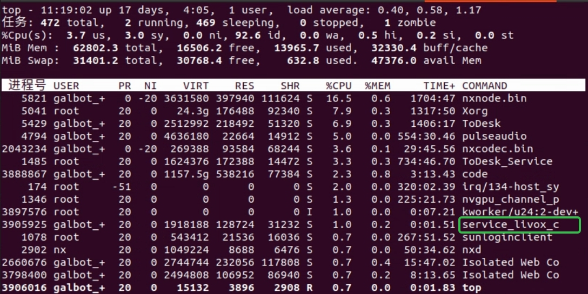

If the LiDAR is not running, use the following command to start it (do not start it repeatedly):

```bash
/data/galbot/bin/service_livox_capture
```

Ensure the map path has write permissions

The default map path is stored in the `/var/maps/` directory. If the path does not exist or does not have write permissions, create the path and grant write permissions:

```bash
sudo mkdir -p /var/maps/
sudo chmod 777 -R /var/maps/
```

#### 2. Start Mapping (Required)

Start the mapping program

1. Press the robot's emergency stop button and push the robot to the mapping start point (mapping can begin from any location)
2. Execute the following command to start mapping:

```bash
/data/galbot/bin/mapping_server
```

During normal mapping, the following information will be displayed:
- Keyframe count (keyframe num)
- Pose delay (time delay)
- Current robot pose (x y z qx qy qz qw)

The keyframe count increases as the robot moves and remains unchanged when the robot is stationary, as shown below:

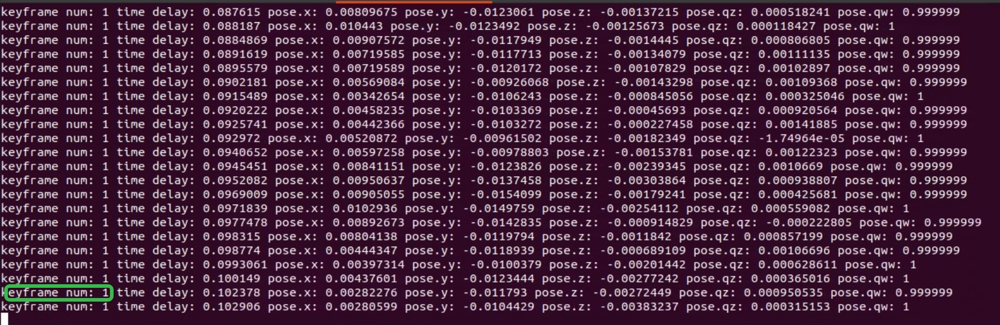

3. Push the robot around the environment once to build a complete map. Avoid excessive acceleration and angular velocity while pushing (approximately walking speed is sufficient)

#### 3. Save the Map (Required)

Save the constructed map

Simply stopping the mapping program will not automatically save the map. If you need to save the map, please perform the save operation before closing the mapping program.

Run the map saving tool:

```bash
/data/galbot/bin/engine_tools
```

After launching the tool, enter `1` and press Enter to select the save map function. The default save path is `/var/maps/room1102`, as shown below:


#### 4. Edit Map (Optional)

This step is used to optimize map quality, improving navigation accuracy and safety.

!!! info "Impact if skipped"
    - **Removing map noise**: Airborne noise points in the map may cause the navigation system to misidentify obstacles, affecting path planning accuracy
    - **Drawing geofences**: Without geofence restrictions, the robot may enter unexpected or dangerous areas

##### 4.1 Remove Map Noise (Optional)

You need to check for noise points within the robot's operating area (from ground level up to 2.5 meters in height). Ground points do not affect navigation; the main focus is on checking and removing airborne floating noise points.

**Preparation**: Download CloudCompare software

Download link: [https://www.cloudcompare.org/release/index.html](https://www.cloudcompare.org/release/index.html)

As shown below:

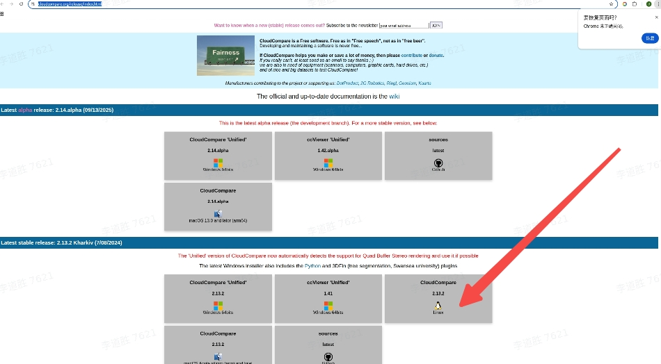

**Steps**:

1. Open CloudCompare and drag the point cloud map `global_cloud.pcd` into the workspace

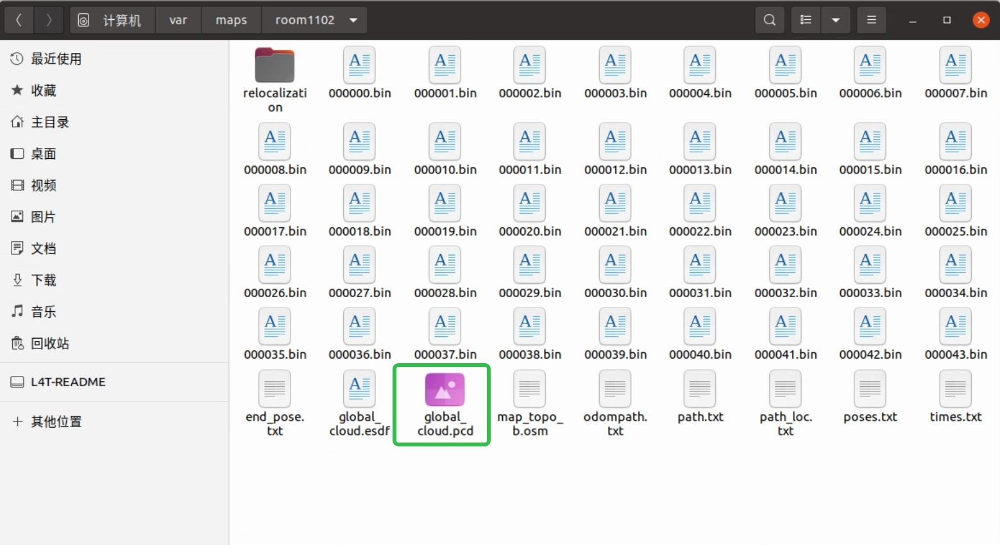

2. Follow the numbered green arrows in the image below:
   - **Step 1**: Check the file
   - **Step 2**: Select the front view
   - **Step 3**: Select the crop tool (scissors icon)
   - **Step 4**: Box-select the target area (between floor and ceiling in the robot's operating area)
   - **Step 5**: Keep the points inside the selection
   - **Step 6**: Confirm the operation (checkmark icon)

The point cloud is now split into two parts: `global_cloud.segmented` inside the selection and `global_cloud.remaining` outside:

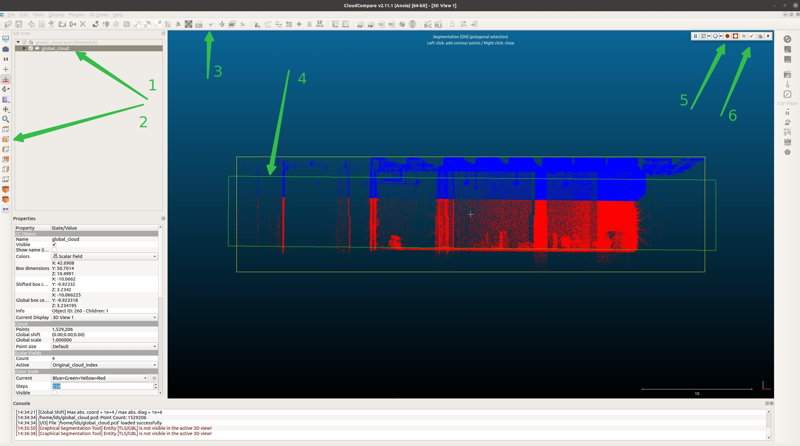

3. Continue with the following steps:
   - **Step 7**: Uncheck `global_cloud.remaining`
   - **Step 8**: Check `global_cloud.segmented`
   - **Step 9**: Select the top view
   - **Step 10**: Select the crop tool (scissors icon)
   - **Step 11**: Box-select the robot's operating area (do not select real obstacles such as stacks or tables)
   - **Step 12**: Click the icon outside the box
   - **Step 13**: Confirm the operation

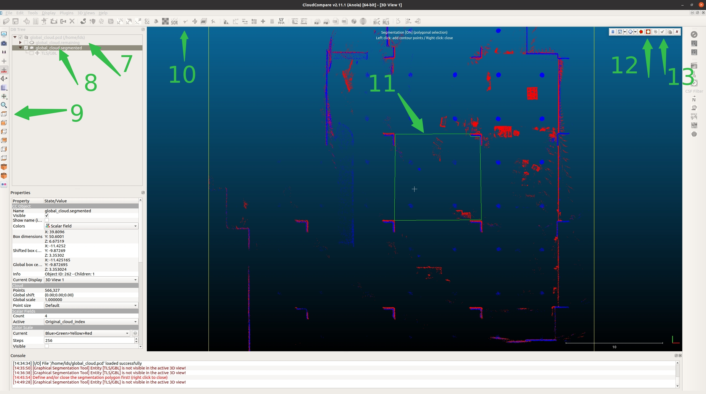

4. Delete noise and merge:
   - Select `global_cloud.segmented.remaining` (noise portion), right-click and delete
   - Hold Ctrl and multi-select `global_cloud.remaining` and `global_cloud.segmented.remaining`

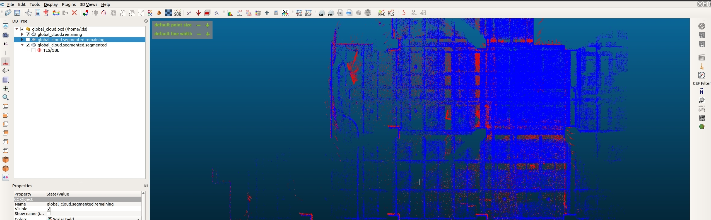

5. Save the cleaned map:
   - Select Edit → Merge to merge the two point clouds
   - Select File → Save to save the point cloud
   - Name it `global_cloud_cleand`
   - Move the cleaned map `global_cloud_cleand.pcd` to the map folder `/var/maps/room1102/`

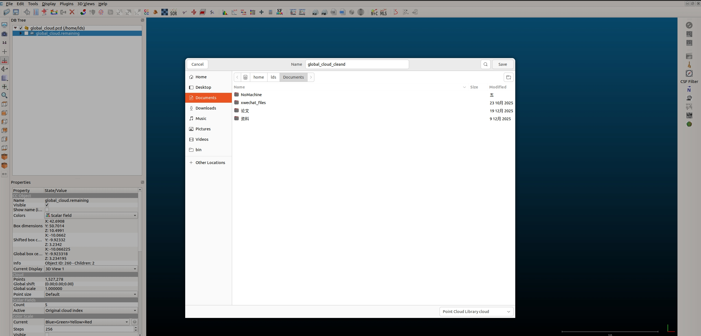

##### 4.2 Edit OSM File (Optional)

Draw geofences to restrict the robot's operating range, preventing it from entering dangerous or unintended areas.

!!! info "Description"
    - **Drawing geofences**: Set virtual boundaries on the map to prohibit the robot from crossing fences into specific areas (such as stairs, dangerous areas, non-work areas, etc.)
    - **Impact if skipped**: The robot can freely move to any position on the map, potentially entering dangerous or unintended work areas, posing safety risks

After mapping is complete (assuming the map is saved at `/var/maps/room1102/`), use the `engine_tools` tool to convert the point cloud map to an OSM file:

1. Run `engine_tools`, enter `3` to select the point cloud to OSM file conversion function
2. Press Enter to use the default map. In this example, the map is stored at `/var/maps/room1102/`, so enter the full path `/var/maps/room1102/global_cloud.pcd` and press Enter to convert:

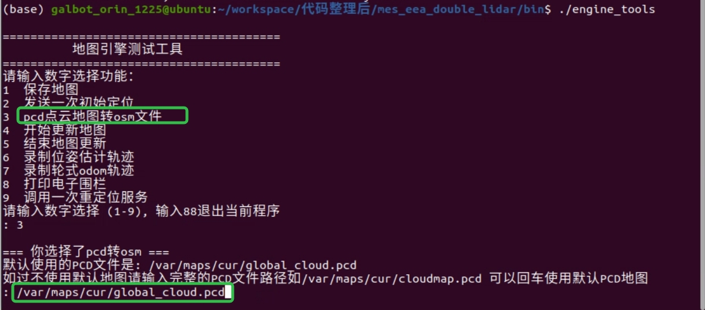

3. The converted file is highlighted in green below. Open the OSM file with JOSM, as shown below:

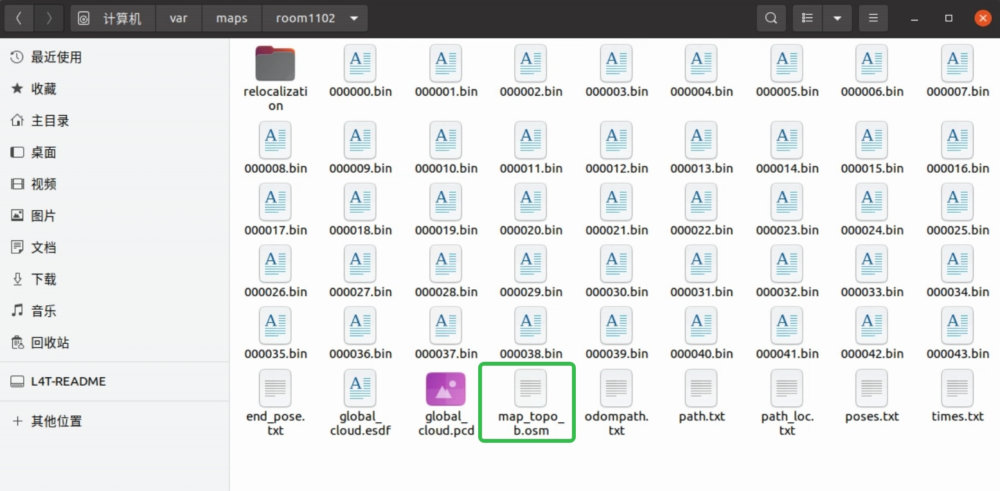

**Install JOSM** (if not installed):

```bash
sudo apt install josm
```

After installation, enter `josm` in the terminal to open the software.

**Steps to draw geofences**:

1. Click File in the top-left corner, choose Open, and locate `/var/maps/room1102/map_topo.osm`
2. Select the tool indicated by white arrow 1, then left-click to draw the shape (thin red line), as shown by white arrow 2
3. After drawing is complete (closed shapes finish automatically; otherwise press Esc), click the icon above white arrow 1 and select the line you just drew. The selected line turns red. Hold Ctrl to select multiple lines. Then click white arrow 3:

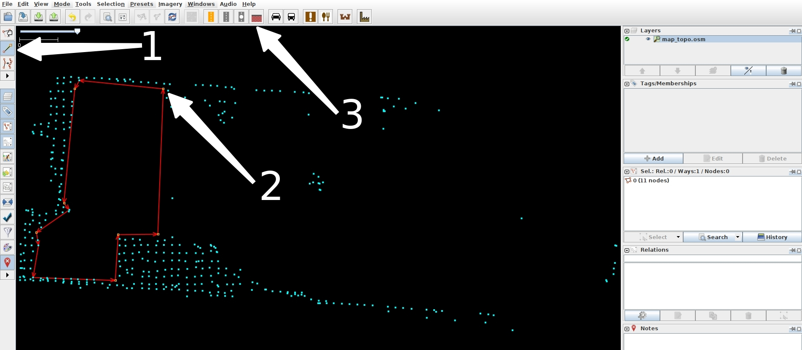

4. In the pop-up, choose the Fence tab, set the type to `barbed_wire` as indicated by white arrow 4, click Apply Preset, then right-click white arrow 5 and choose Save:

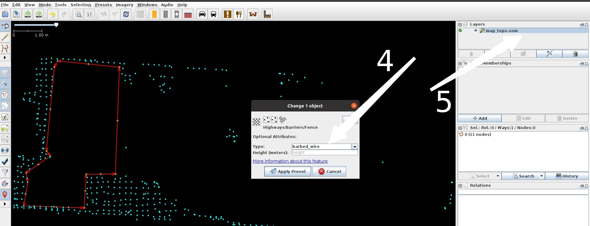

#### 5. Map Update (Optional)

When the environment changes (e.g., new furniture added, obstacles moved, etc.), you can optimize the map using the map update function.

!!! info "Impact if skipped"
    If the environment changes and the map is not updated, the robot will continue to navigate using the old map, which may lead to:
    - Decreased localization accuracy
    - Inaccurate path planning
    - The robot may misidentify obstacle positions

To save computing resources, the map update feature is disabled by default. You can manually enable the update switch and save the updated map:

**Step 1**: When localization is stable (current score > 0.9), enable the map update switch

```bash
vim /data/galbot/config/mes/manager.config
```

Change `manager_update_map=0` to `manager_update_map=1`

**Step 2**: Restart localization in place. Once the score returns to normal (current score > 0.9), run `engine_tools` and choose Start Map Update

**Step 3**: Push the robot around the environment for one full loop, then run `engine_tools` and choose Stop Map Update

**Step 4**: The updated map will not overwrite the current localization map (`/var/maps/cur`). It will be saved to `/var/maps/update_map`

**Step 5**: After finishing the map update, change `manager_update_map=1` back to `0`, then replace the map if needed

!!! warning "Important Notes"
    1. Both parameter changes and map replacement require restarting the localization service to take effect
    2. This example uses `engine_tools`. If you don't have `engine_tools`, use `/data/galbot/bin/test_start_update_map` and `/data/galbot/bin/test_stop_update_map` instead

---

### Localization Process

Localization is a prerequisite for navigation. Before starting navigation, you must ensure the localization service is running properly and the localization status is good.

#### 1. Prepare the Map (Required)

The localization program requires the LiDAR to be running (it does not depend on the mapping program, so you can close the mapping program after it finishes).

Localization uses the map path `/var/maps/cur`. Rename the target map to `cur` (for example, rename the newly created map `room1102` to `cur`), as shown below:

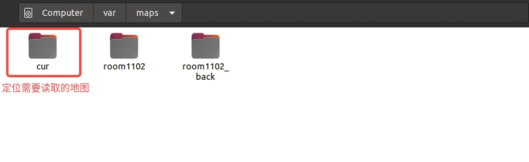

#### 2. Start Localization (Required)

Start the localization service:

```bash
/data/galbot/bin/localization_server
```

#### 3. Check Localization Status (Required)

Check localization status:

```bash
tail -f /userdata/log/localization_server/localization_server.INFO
```

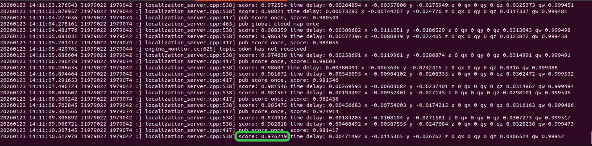

If the score is below 0.75 or no score/pose is published, push the robot to the mapping start pose and send an initial pose once (use `engine_tools`, enter `2`, and press Enter), as shown below:

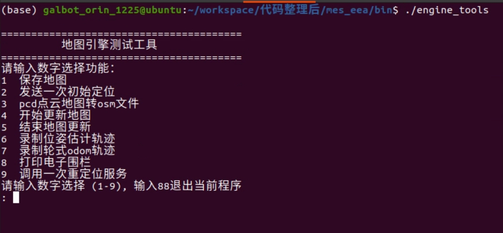

#### 4. Verify Localization Ready (Required)

Before starting navigation, please confirm the following checklist items:

- [ ] LiDAR service is running
- [ ] Localization service has been started
- [ ] Localization score is greater than 0.75
- [ ] Current pose is being published normally

!!! success "Ready to Go"
    After completing all the required steps above, you can start using the robot navigation function. For details, please refer to [Tutorials - Example 3. Robot Navigation](./tutorials.md).
