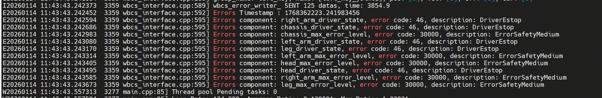
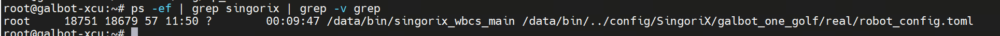
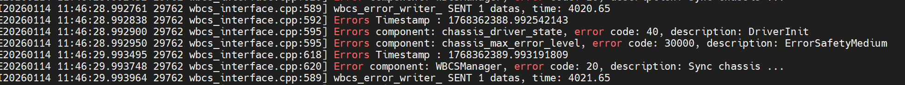
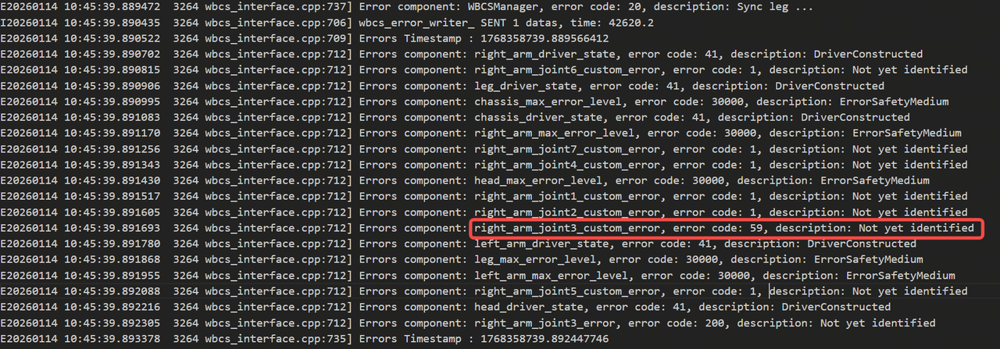
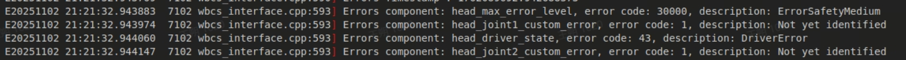
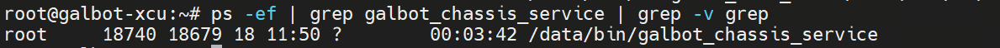
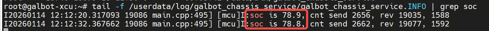
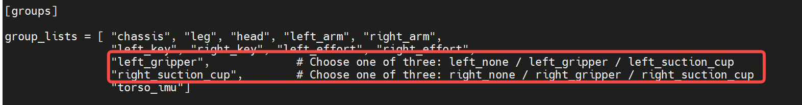

# Troubleshooting

This document describes common issues and solutions encountered during SDK usage.

## Control Issues

### No Response to Control Commands

#### Possible Cause 1: Robot in Emergency Stop State

Check if the red emergency stop button on the back of the robot is pressed (not released). View the singorix log using the following command to confirm the status:

```bash
tail -f /userdata/log/SingoriX/info/singorix_wbcs_main.INFO
```



#### Possible Cause 2: Control Service Not Started

Execute the following command to check if the singorix service is running properly:

```bash
ps -ef | grep singorix | grep -v grep
```



#### Possible Cause 3: Chassis Service Abnormality

The chassis service has not started or is running abnormally. Check the chassis service status with the following command:

```bash
ps -ef | grep chassis
```

Also check the singorix log for detailed error information:

```bash
tail -f /userdata/log/SingoriX/info/singorix_wbcs_main.INFO
```



### Robot Joint Cannot Move

This issue applies to situations where a joint in the head, legs, or arms is unresponsive.

#### Possible Cause 1: Joint Exceeds Motion Range Limit

The joint position may have reached or exceeded its mechanical limit. This issue is more common in arm joints and can be visually observed as abnormal joint posture. Singorix will output corresponding error information. Check the log:

```bash
tail -f /userdata/log/SingoriX/info/singorix_wbcs_main.INFO
```



#### Possible Cause 2: Joint Initialization Failed

During robot startup, the joint failed to successfully release the brake (no brake release sound). Singorix will output initialization failure error information:

```bash
tail -f /userdata/log/SingoriX/info/singorix_wbcs_main.INFO
```

The following screenshot shows an example of head joint initialization failure:



#### Possible Cause 3: MCU Malfunction

The microcontroller unit (MCU) may have encountered an error or stopped responding. Check the latest log files in the `/userdata/log/mp_core/` and `/userdata/log/secure_core` directories to confirm whether the logs are continuously updated and have no error messages.

> **Note**: Screenshot currently unavailable

### Robot Chassis Cannot Move

#### Possible Cause 1: Chassis Service Not Started

Check if the chassis control service is running properly:

```bash
ps -ef | grep galbot_chassis_service | grep -v grep
```



#### Possible Cause 2: Battery Level Too Low

When the robot battery level falls below 25%, the chassis will stop operating to protect the battery. Check the current battery level (SOC) with the following command:

```bash
tail -f /userdata/log/galbot_chassis_service/galbot_chassis_service.INFO | grep soc
```



### End Effector Control Failure

This issue applies to situations where the gripper or suction cup cannot be controlled properly.

#### Possible Cause 1: End Effector Hardware Malfunction

Press and release the emergency stop button and observe whether the end effector (gripper or suction cup) responds. If there is no action, there may be a hardware malfunction.

#### Possible Cause 2: End Effector Configuration Mismatch

The default singorix configuration is left hand gripper and right hand suction cup. Check if the type of end effector currently installed on the robot matches the configuration. If not, modify the following configuration file:

```
/data/config/SingoriX/galbot_one_golf/real/robot_config.toml
```



## Motion Planning Issues

### Inverse Kinematics Solution Failed

