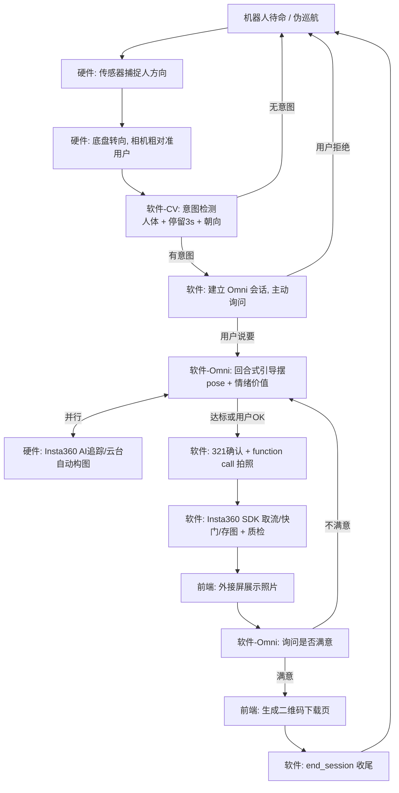
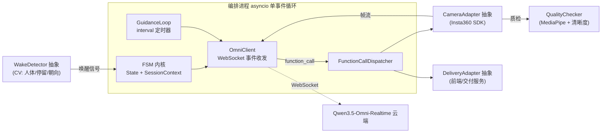
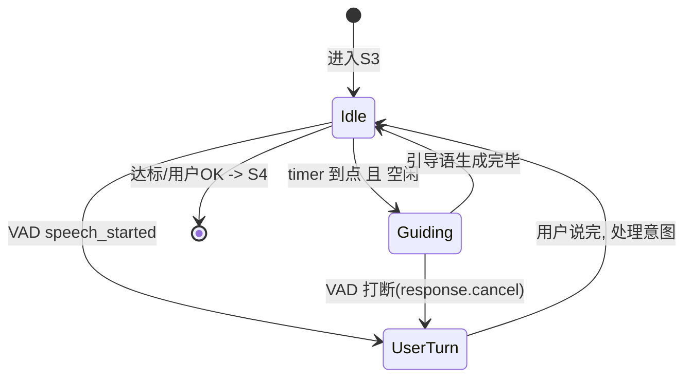
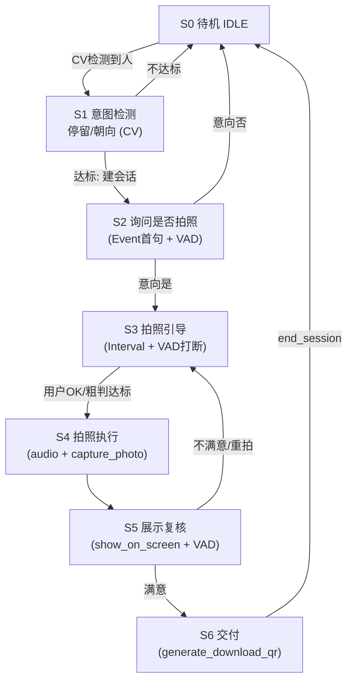
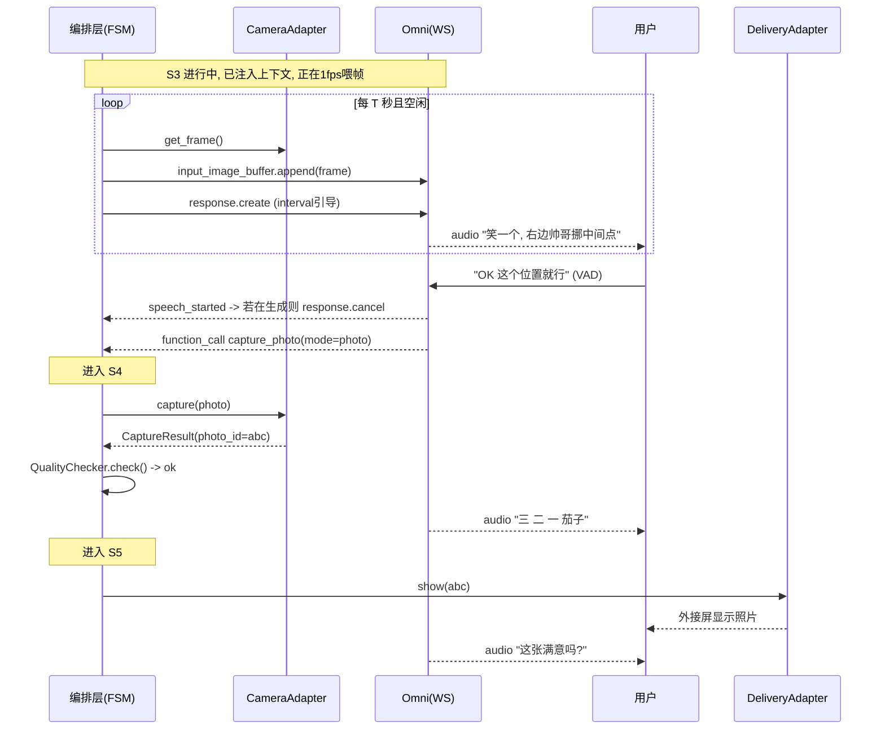

# 拍照 Agent 产品需求文档（PRD）

> 面向活动现场的具身摄影助理 —— 语音引导拍照 Agent
> 载体：银河通用 G1 + Insta360 Link 2C ｜ 大脑：Qwen3.5-Omni-Realtime
> 版本：v1（黑客松 MVP）｜ 阅读对象：**Coding Agent / 软件工程师**

---

## 阅读指南（写给 Coding Agent）

本文分两大部分，请按需取用：

- **Part A · 产品总览**：建立全局认知——产品是什么、完整交互链路、五人如何分工。你在实现任何单点前，先读 A 部分理解上下文。
- **Part B · 软件工程师深度设计**：本次要落地的**软件负责段落**（粗定位之后 → 交付完成，对应状态机 S1–S6）的交互流程与技术架构。**所有编码任务都在 Part B。**

开发方式：**TDD，按状态机 S1–S6 逐段做端到端验证**（每段 mock 上下游、独立跑通），最后汇总集成。每个状态在 B5/B9 都给出「行为契约 + 验收标准」，可直接作为测试用例来源。

---

# Part A · 产品总览

## A1. 产品定位与设计思路

一句话定位：

> **一个有情绪价值的 AI 摄影师机器人**——主动搭话、逗用户开心、指导摆 pose，用自然语音完成「发现用户 → 引导拍照 → 确认交付」的完整服务，而不是一台冷冰冰的自动快门。

核心设计思路（决定一切技术选择）：

1. **产品灵魂 = 情绪价值 + 自然语音交互**，不是精密构图。精密/基础构图交给硬件（Insta360 的 AI 追踪与云台），软件不做像素级构图纠正。
2. **让每个模块只做它最擅长的事**（见 A5 铁律）。系统稳定性建立在清晰的职责边界上。
3. **主拍摄路线 = Insta360 link相机（方案 B）**。算法与展示空间更大、电子照片可交付。
4. **MVP 优先跑通一条稳定闭环**，加分项（打印、短视频、递照片、复杂导航）全部后置。

完整背景见 [project.md](project.md)。

## A2. 硬件与外设总览


| 部件                        | 作用                           | v1 是否主线       |
| ------------------------- | ---------------------------- | ------------- |
| 银河通用 G1 轮式双臂机器人           | 移动、粗定位、承载外设、机械臂动作            | 是（粗定位/预设位姿）   |
| Insta360 Link 2C（USB 接主机） | 取流、AI 人脸追踪、云台/变焦、软件快门        | 是（主拍摄设备）      |
| 外接显示屏                     | 展示状态 / 照片预览 / 二维码 / 付款码 / 菜单 | 是（电子交付载体）     |
| 灵巧手（右臂）                   | 点手机快门、抽取/递照片                 | 否（方案 A / 加分项） |
| 手机夹具（左腕）                  | 持握用户手机拍照                     | 否（方案 A / 加分项） |
| 口袋打印机                     | 打印实体照片                       | 否（加分项）        |
| 补光灯                       | 氛围光 / 暗光补光                   | 否（加分项）        |


## A3. 完整用户交互端到端流程

从用户视角的全链路（跨硬件/软件/前端三方）：




对应到状态机（软件视角，Part B 展开）：粗定位由硬件完成后，软件从 **S1 意图检测**接管，历经 S2 询问、S3 引导、S4 拍照、S5 复核、S6 交付。

## A4. 五人分工与职责边界

（依据「以此版本为准」分工图；★ 为本 PRD Part B 深度覆盖的软件段落）


| 成员            | 负责环节                                                                                                                   | 关键交付                                             |
| ------------- | ---------------------------------------------------------------------------------------------------------------------- | ------------------------------------------------ |
| 硬件工程师         | 机械结构改装；**粗定位+转向**；GalbotSDK 对接；Insta360 AI 追踪/云台联调；机械臂预设位姿；供电/线缆/稳定性                                                   | 把用户粗对准相机；相机具备 AI 追踪构图能力                          |
| **软件工程师（本文）** | ★ **CV 意图检测**；★ **Omni 接入+编排状态机**；★ **回合式引导**；★ **function call 拍照**；★ **Insta360 SDK 取流/快门/存图**；★ **质检**；★ **串接交付接口** | S1–S6 全链路（关键路径）                                  |
| 前端工程师         | 外接屏 UI（状态/预览/二维码/付款码/菜单）；照片交付页（扫码下载 + 存图接口 FastAPI）                                                                    | `show_on_screen` / `generate_download_qr` 的后端与页面 |
| 运营 A          | 商业模式/定价/对标；现场用户测试；隐私合规话术                                                                                               | demo 场景与体验验证                                     |
| 运营 B（+PPT）    | Demo 脚本（话术写进 base prompt）；PPT；现场主持/控场/录屏                                                                               | 情绪价值话术库、演示流程                                     |


> 归属说明：**CV 意图检测在 v1 归软件工程师**（在编排进程内以协程/子模块实现），与旧版本「归硬件」的写法不同，以本表为准。


## A5. 模块职责铁律（最重要）


| 模块                    | 只负责                                                         | 明确不负责            |
| --------------------- | ----------------------------------------------------------- | ---------------- |
| Insta360 Link 2C      | AI 人脸追踪、云台构图、变焦、基础构图、拍照                                     | ——               |
| Qwen3.5-Omni-Realtime | 听懂话、自然对话、情绪价值、pose 引导、看画面做**粗**判断、发 function call           | 常驻触发检测、精细构图、精确质检 |
| 本地轻量 CV               | 常驻人体检测 + 停留计时 + 朝向（唤醒触发）；拍后质检（人脸/闭眼/清晰度）                    | 复杂视觉推理、连续构图纠正    |
| 编排层（asyncio FSM）      | 持有显式状态、驱动转移、interval 定时触发引导、分发 function call、管理 Omni 会话与上下文 | ——               |
| 前端 / 交付服务             | 外接屏 UI、照片展示、二维码生成与下载页                                       | ——               |


三条铁律：

1. **Omni 不是状态机本身**，它是被状态机在每个环节调用的「交互大脑」。显式状态由编排层持有。
2. **Omni 无自主时钟**，一轮回复必须被触发；主动引导由编排层按 **interval 定时**触发。
3. **常驻触发 / 精细构图 / 精确质检**这三件 Omni 做不好的事，v1 分别交给本地 CV / Insta360 / 本地 CV（质检）或推迟到 v2。

---


# Part B · 软件工程师深度设计（S1–S6）


## B1. 软件范围与系统架构

**范围**：粗定位完成之后，从 S1 意图检测到 S6 交付收尾的完整闭环（含前端交付的软件侧串接）。

**技术栈**：Python 3.10+ ｜ `asyncio` 事件循环 ｜ `websockets`（Omni Realtime 客户端）｜ `mediapipe` / `opencv-python`（CV 唤醒与质检）｜ 单进程。

**编排层实现**：手写 **asyncio 显式状态机**（不引入 LangGraph）。控制流确定、易调试，天然匹配 WebSocket 全双工事件循环 + interval 定时 + VAD 打断。

系统组件图：




三个下游依赖以**抽象接口（ABC）**隔离（见 B7），TDD 时用 mock 替身，使软件段落可脱离硬件/前端独立跑通。

## B2. 进程与并发模型

单一 asyncio 事件循环内并发运行的协程（Task）：


| 协程                | 职责                                                               | 生命周期                |
| ----------------- | ---------------------------------------------------------------- | ------------------- |
| `omni_recv_loop`  | 持续读取 Omni WS 事件（audio / text / function_call / vad 事件），投递到内部事件队列 | 会话建立 → 关闭           |
| `frame_feed_loop` | 从 `CameraAdapter` 取帧，按 ~1fps `input_image_buffer.append` 喂给 Omni | S2 起（发过开场音频后）→ 会话关闭 |
| `guidance_timer`  | 仅在 S3 激活；每 T 秒（4~6s）在空闲时发 `response.create` 触发一句引导               | 进入 S3 → 离开 S3       |
| `fsm_main`        | 消费内部事件、执行状态转移、调度 function call 分发                                | 全程                  |


**并发与优先级规则：**

- 编排层维护 `response_in_flight: bool`，标记当前是否有 Omni 回复在生成。
- `guidance_timer` **仅在** `response_in_flight == False` **时**发起 interval 引导，避免叠话。
- 用户语音（VAD 捕获）**优先级最高**：收到 `input_audio_buffer.speech_started` 时，若有 interval 引导在生成中，发 `response.cancel` 让位。
- 所有对 Omni 的写操作经 `OmniClient` 串行化（单写锁），避免协议乱序。


## B3. Omni 会话与记忆机制

**策略：一次用户接待 = 一个持久 WebSocket 会话；base prompt + 编排层逐环节注入上下文。**

1. **会话建立（S1 唤醒达标后）**
  - `session.update` 注入 **base prompt**（角色、语气、整体流程、可用 tools、VAD 配置）。
  - 先发一段**开场音频**（满足「发图前须先发过音频」的前置约束），随后 `frame_feed_loop` 开始持续喂帧（~1fps）。
2. **环节切换**：每进入新状态，编排层注入一条**上下文事件**（`conversation.item.create`，一条 system/user 文本，如「当前进入【拍照引导】环节，请引导用户摆 pose 并提供情绪价值」），无需重建会话、无需重发 base prompt。
3. **记忆**
  - 会话内：Omni 自然保有上下文（记得说过/看过什么），支撑连贯对话与「再来一张」。
  - 跨会话：无持久记忆；S6 结束或超时即关闭会话，下个用户重建会话。跨会话用户档案属 v2。

**base prompt 要点（示例大纲，实现时由运营 B 话术库细化）：**

- 角色：热情、幽默、会逗人开心的活动摄影师。
- 目标：让用户放松、笑出来、拍出好照片。
- 风格：短句、口语、有梗、不啰嗦；**每轮只说 1~2 句**。
- 工具：`capture_photo` / `show_on_screen` / `generate_download_qr` / `end_session`。
- 约束：构图只做**粗**引导（"往中间站一点""笑一个"），不纠结精度。

**模型选型（已核实）：**


| 项                | 选择                                                         | 说明                                                     |
| ---------------- | ---------------------------------------------------------- | ------------------------------------------------------ |
| 模型               | `qwen3.5-omni-flash-realtime`（MVP）/ `-plus-realtime`（能力优先） | 均支持实时 WebSocket + Function Calling                     |
| 协议               | **WebSocket**                                              | 需要 Manual/interval 手动 `response.create`；WebRTC 仅支持 VAD |
| Function Calling | 开启                                                         | 发拍照/展示/二维码等动作指令                                        |
| 联网搜索             | 关闭                                                         | 官方限制：与 Function Calling 不可同时开启                         |
| 图像输入             | 发图前须先发过音频；~1 张/秒；480P/720P；单张 Base64 ≤ 256KB               | 故 Omni 构图判断只能"粗"                                       |
| 会话时长             | 单会话最长 120 分钟                                               | 接近上限需优雅重建                                              |


## B4. 回合式引导机制（interval 触发）

v1 的核心交互设计，用于规避「连续流式纠正」的啰嗦/摇摆/延迟问题。

- 在 **S3 拍照引导**，`guidance_timer` 每 **T 秒（建议 4~6s）** 在空闲时发一次 `response.create`：Omni 看当前帧 → 说**一句**引导 / 情绪价值话术。
- 用户可**随时语音打断**（VAD），说"OK 这个位置就行"/"帮我拍个跳起来的" → Omni 理解意图 → 决定拍照或调整。
- 并发控制见 B2（`response_in_flight` 闸门 + VAD 优先 `response.cancel`）。




> 实测点（B11）：需验证 `qwen3.5-omni-realtime` 是否允许「VAD 开启的同时手动 `response.create`」。若不允许，回退为纯 Manual 模式（`turn_detection=null` + 本地轻量 VAD 检测后 `commit`+`response.create`）。


## B5. 状态机详细设计（S1–S6）

统一结构：`触发/输入 · 行为 · 转移条件 · 涉及接口 · 异常兜底`。图例 `模式` = Omni 触发方式（CV / VAD / Interval / Event）。

### 全局状态流转图




### S1 · 意图检测 DETECT_INTENT（模式：CV，非 Omni）

- **触发/输入**：硬件粗定位后，`WakeDetector` 持续输出摄像头画面上的检测结果。
- **行为**：判断「检测到人 + **停留 ≥ 3s** + 面向机器人（朝向/eyes）」。
- **转移**：达标 → 建立 Omni WS 会话（注入 base prompt + 开场音频）→ S2；不达标 → 回 S0。
- **涉及接口**：`WakeDetector.poll()`；`OmniClient.connect()` / `session.update`。
- **异常兜底**：抖动去噪（连续 N 帧满足才算达标）；建会话失败重试 1 次，仍失败回 S0 并记日志。


### S2 · 询问是否拍照 ASK_INTENT（模式：Event 首句 + VAD 听回答）

- **触发/输入**：进入即由编排层 `response.create` 触发首句；随后监听用户语音（VAD）。
- **行为**：Omni 主动开口："嗨～需要我帮你拍张照吗？"
- **转移**：意向"是" → S3；意向"否" → 友好回应 → 关闭会话 → S0。
- **涉及接口**：`OmniClient.create_response()`；VAD 事件。
- **异常兜底**：超时无回应 → 补一句；再无回应 → 关会话回 S0。


### S3 · 拍照引导 POSE_GUIDANCE（模式：Interval 主动 + VAD 打断）★核心

- **触发/输入**：`guidance_timer` 每 T 秒空闲触发；用户可随时 VAD 打断。
- **行为**：提供情绪价值（逗趣/鼓励）+ **粗** pose 引导（"往中间站一点""比个耶"）。基础构图由 Insta360 AI 追踪自动完成。
- **转移（→ S4）**：满足任一——用户明确表示可以拍（"OK/好了/拍吧"）；或 Omni 粗判达标且已引导数轮。
- **涉及接口**：`frame_feed_loop`（喂帧）；`OmniClient.create_response()` / `cancel_response()`；VAD 事件。
- **异常兜底**：引导超过上限轮次仍未达标 → 主动收敛（"那我先拍一张？"）；喂帧中断 → 降级为纯语音引导并告警。


### S4 · 拍照执行 SHOOT（模式：audio + function call）

- **触发/输入**：由 S3 转入。
- **行为**：Omni 语音倒数确认 → "看镜头，三——二——一，茄子！"；同一轮并行输出 `audio` + `function_call: capture_photo(mode="photo")`。
- **动作**：`FunctionCallDispatcher` 收到 `capture_photo` → 调 `CameraAdapter.capture()` → 得 `photo_id`；随后 `QualityChecker` 质检（人脸在框/未闭眼/清晰）。
- **转移**：拍摄+质检完成 → S5。
- **涉及接口**：`capture_photo`（B7）；`CameraAdapter.capture()`；`QualityChecker.check()`。
- **异常兜底**：质检不通过 → 语音提示原因（"刚才有人眨眼啦，再来一张"）→ 回 S3 或就地重拍（重试上限 2 次）；快门失败 → 重试 + 语音致歉。


### S5 · 展示与满意度复核 REVIEW（模式：function call + VAD）

- **触发/输入**：由 S4 转入。
- **行为**：`function_call: show_on_screen(photo_id)` → 前端外接屏显示；Omni 语音询问"这张怎么样？满意吗？"（可把照片回喂 Omni 一起点评）。
- **转移**：满意 → S6；不满意/重拍 → 回 S3。
- **涉及接口**：`show_on_screen`（B7）；`DeliveryAdapter.show(photo_id)`；VAD 事件。
- **异常兜底**：屏幕展示失败 → 语音兜底描述并重试；超时无回应 → 默认视为满意进入 S6（避免卡死）。


### S6 · 交付 DELIVER（模式：function call）

- **触发/输入**：由 S5 转入。
- **行为**：`function_call: generate_download_qr(photo_id)` → 交付服务生成二维码 → 前端显示；Omni："扫屏幕上的二维码就能带走照片啦，玩得开心！"
- **收尾**：`function_call: end_session(reason="delivered")` → 关闭会话 → 回 S0。
- **涉及接口**：`generate_download_qr` / `end_session`（B7）；`DeliveryAdapter.generate_qr(photo_id)`。
- **异常兜底**：二维码生成失败 → 重试 + 提供口播取图码兜底；无论成败最终都要 `end_session` 复位，防止会话泄漏。


## B6. 数据模型

```python
from dataclasses import dataclass, field
from enum import Enum, auto
from typing import Optional


class State(Enum):
    IDLE = auto()            # S0
    DETECT_INTENT = auto()   # S1
    ASK_INTENT = auto()      # S2
    POSE_GUIDANCE = auto()   # S3
    SHOOT = auto()           # S4
    REVIEW = auto()          # S5
    DELIVER = auto()         # S6


@dataclass
class GuidanceTurn:
    ts: float                # 触发时间戳
    prompt_source: str       # "interval" | "user_vad"
    text: str                # Omni 引导话术（用于日志/回放）


@dataclass
class SessionContext:
    """一次用户接待的全部运行时状态，由 FSM 持有。"""
    state: State = State.IDLE
    session_id: Optional[str] = None
    photo_id: Optional[str] = None
    qr_url: Optional[str] = None

    # 引导过程
    guidance_turns: list[GuidanceTurn] = field(default_factory=list)
    response_in_flight: bool = False
    retake_count: int = 0

    # 计时/配额
    session_started_at: float = 0.0
    guidance_interval_s: float = 5.0
    max_guidance_turns: int = 8
    max_retake: int = 2

    def reset(self) -> None:
        """回到 S0 前清空一次接待的状态。"""
        self.__init__()
```


## B7. 接口契约


### B7.1 Omni 协议事件（编排层 ↔ 云端，WebSocket）


| 方向  | 事件                                               | 用途                              |
| --- | ------------------------------------------------ | ------------------------------- |
| 发   | `session.update`                                 | 注入 base prompt / tools / VAD 配置 |
| 发   | `input_audio_buffer.append`                      | 喂用户/开场音频                        |
| 发   | `input_image_buffer.append`                      | 喂 Insta 画面帧（~1fps）              |
| 发   | `response.create`                                | 手动触发一轮回复（interval 引导 / 首句）      |
| 发   | `response.cancel`                                | 打断当前生成（VAD 让位）                  |
| 发   | `conversation.item.create`                       | 注入环节上下文文本                       |
| 收   | `response.audio.delta` / `.done`                 | 语音输出                            |
| 收   | `response.function_call_arguments.done`          | function call 指令                |
| 收   | `input_audio_buffer.speech_started` / `_stopped` | VAD 事件                          |


### B7.2 Function Call 契约（Omni → 编排层分发）

```json
{
  "name": "capture_photo",
  "description": "触发 Insta360 相机拍照。在与用户完成321倒数确认后调用。",
  "parameters": {
    "type": "object",
    "properties": {
      "mode": { "type": "string", "enum": ["photo", "video"], "description": "拍照或短视频" }
    },
    "required": ["mode"]
  }
}
```

返回：`{ "photo_id": "string", "path": "string", "quality_ok": true, "ok": true }`

```json
{
  "name": "show_on_screen",
  "description": "在外接屏幕上展示指定照片，供用户复核。",
  "parameters": {
    "type": "object",
    "properties": { "photo_id": { "type": "string" } },
    "required": ["photo_id"]
  }
}
```

返回：`{ "ok": true }`

```json
{
  "name": "generate_download_qr",
  "description": "为指定照片生成下载二维码并在屏幕展示，供用户扫码带走。",
  "parameters": {
    "type": "object",
    "properties": { "photo_id": { "type": "string" } },
    "required": ["photo_id"]
  }
}
```

返回：`{ "qr_url": "string", "download_url": "string", "ok": true }`

```json
{
  "name": "end_session",
  "description": "结束本次拍照服务，机器人回到待机。",
  "parameters": {
    "type": "object",
    "properties": {
      "reason": { "type": "string", "enum": ["delivered", "user_declined", "timeout"] }
    },
    "required": ["reason"]
  }
}
```

返回：`{ "ok": true }`

预留（v1.5+）：`set_fill_light(state, color)` / `retake()` / `print_photo(photo_id)`。

### B7.3 下游适配器抽象（TDD mock 边界）

三个下游依赖全部以 ABC 定义，真实实现由硬件/前端提供，测试时用 mock 替身。**这是软件段落能独立 e2e 的关键。**

```python
from abc import ABC, abstractmethod
from typing import Optional
import numpy as np


class WakeDetector(ABC):
    """常驻 CV 唤醒检测（人体 + 停留 + 朝向）。"""
    @abstractmethod
    async def poll(self) -> "WakeSignal": ...


@dataclass
class WakeSignal:
    person_present: bool
    dwell_seconds: float
    facing_robot: bool

    def is_awake(self, dwell_threshold: float = 3.0) -> bool:
        return self.person_present and self.facing_robot and self.dwell_seconds >= dwell_threshold


class CameraAdapter(ABC):
    """Insta360 SDK 封装：取流 / 快门 / 存图。"""
    @abstractmethod
    async def get_frame(self) -> np.ndarray: ...
    @abstractmethod
    async def capture(self, mode: str = "photo") -> "CaptureResult": ...


@dataclass
class CaptureResult:
    photo_id: str
    path: str
    ok: bool


class QualityChecker(ABC):
    """拍后质检：人脸在框 / 未闭眼 / 清晰度（MediaPipe + 拉普拉斯）。"""
    @abstractmethod
    def check(self, image: np.ndarray) -> "QualityResult": ...


@dataclass
class QualityResult:
    face_in_frame: bool
    eyes_open: bool
    sharp: bool
    reason: Optional[str] = None

    @property
    def ok(self) -> bool:
        return self.face_in_frame and self.eyes_open and self.sharp


class DeliveryAdapter(ABC):
    """前端 / 交付服务：展示照片 + 生成二维码。"""
    @abstractmethod
    async def show(self, photo_id: str) -> bool: ...
    @abstractmethod
    async def generate_qr(self, photo_id: str) -> "DeliveryResult": ...


@dataclass
class DeliveryResult:
    qr_url: str
    download_url: str
    ok: bool
```


## B8. 关键时序图（S3 → S4 → S5）




> 时序对齐注意：倒数"321"与实际快门需对齐——建议 Omni 先说完"321茄子"、由编排层在末字触发实际 `capture_photo`，避免拍到说话中的表情。此为 B11 待实测项。


## B9. TDD 分段验收（S1–S6 逐段 e2e）

每段用 mock 替身隔离上下游，独立跑通后再汇总集成。断言聚焦「状态转移 + 对外调用序列」。

### S1 意图检测

- **目标**：唤醒判定正确、达标即建会话。
- **mock**：`WakeDetector`（可编排 poll 返回序列）、`OmniClient`（记录 connect/session.update 调用）。
- **输入序列**：person_present + facing + dwell 从 1s→3.2s。
- **期望/断言**：dwell<3s 不建会话；≥3s 恰好触发一次 `connect()` + `session.update()`，状态转 S2；抖动（中途 person_present=False）不误触发。


### S2 询问是否拍照

- **目标**：进入即主动首句；正确解析 是/否/超时。
- **mock**：`OmniClient`（可注入 VAD 结果与用户文本）。
- **输入序列**：分别注入"要/好啊"、"不用了"、无回应超时。
- **期望/断言**："是"→S3；"否"→`end_session` 后回 S0；超时→补问一次后回 S0。


### S3 拍照引导 ★

- **目标**：interval 触发节流、VAD 打断优先、达标转 S4。
- **mock**：`CameraAdapter.get_frame`、`OmniClient`（模拟生成中/空闲、可注入用户"可以拍了"）。
- **输入序列**：空转 15s（应触发约 3 次引导）；生成中禁止叠发；注入 VAD 打断验证 `response.cancel`；注入"拍吧"。
- **期望/断言**：仅在空闲发 `response.create`；`response_in_flight` 为真时不发；VAD 到达触发一次 `cancel`；"拍吧"→S4；超过 `max_guidance_turns` 自动收敛。


### S4 拍照执行

- **目标**：capture 分发、质检门控、失败重试。
- **mock**：`CameraAdapter.capture`（可返回成功/失败）、`QualityChecker`（可返回 ok/闭眼）。
- **输入序列**：正常拍摄；质检闭眼一次后正常。
- **期望/断言**：收到 `capture_photo` 调 `capture()` 一次并得 photo_id；质检 ok→S5；质检 fail→语音提示且回 S3/重拍，`retake_count` 递增且不超过 `max_retake`。


### S5 展示复核

- **目标**：展示分发、满意度分流、超时兜底。
- **mock**：`DeliveryAdapter.show`、`OmniClient`（注入 满意/不满意/超时）。
- **输入序列**：分别注入三种。
- **期望/断言**：进入即调 `show(photo_id)` 一次；满意→S6；不满意→S3；超时→默认满意→S6。


### S6 交付

- **目标**：二维码生成、收尾复位、失败也复位。
- **mock**：`DeliveryAdapter.generate_qr`（成功/失败）、`OmniClient`。
- **输入序列**：正常；生成失败一次。
- **期望/断言**：调 `generate_qr()` 得 qr_url；无论成败最终必调 `end_session` 且状态回 S0、`SessionContext.reset()` 生效。


### 汇总集成

- 用 mock 串起 S1→S6 完整走一遍（happy path）+ 两条回环（S5 不满意→S3、S4 质检失败→S3），验证无状态泄漏、会话正确关闭。


## B10. 非功能需求


| 维度   | 要求                                      |
| ---- | --------------------------------------- |
| 延迟   | 语音回复端到端目标 < 1.5s；interval 引导间隔 4~6s     |
| 稳定性  | 断网兜底：切预录话术 / 本地模型；关键动作（拍照）失败要有重试与语音提示   |
| 会话管理 | 每用户一会话，服务结束即关；监控 120 分钟上限，接近时优雅重建       |
| 隐私   | 照片默认本地处理；用户下载后可删；不做未授权云存储/训练；话术中明示      |
| 并发   | v1 单机单用户串行服务；不做多用户并发                    |
| 可观测  | 结构化记录每次状态流转与 function call 调用，便于现场调试与回放 |


## B11. 待实测 / 风险项

1. **[需实测]** `qwen3.5-omni-realtime` 是否支持「VAD 开启 + 手动 `response.create` 并存」（决定 B4 走首选还是纯 Manual 回退）。
2. **[需实测]** interval 触发下 Omni 的「沉默控制」——能否让它在无需说话时少说/不说，避免啰嗦。
3. **[需实测]** Insta360 Link 2C 经 USB 的取流帧率、AI 追踪/云台可控性、软件快门接口（影响 `CameraAdapter` 真实实现）。
4. **[需确认]** 倒数"321"与实际快门的时序对齐方案（B8 注）。
5. **[需确认]** 现场网络质量与兜底（是否上本地 MiniCPM-o）。

