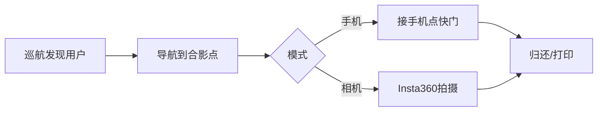

# 路演 PPT 逐页大纲（7/7 飞机上填内容）

> 目标 12–15 页，5 分钟讲完。每页 1 个信息点 + 1 张图。  
> 素材：7/10 录真机视频后替换占位图。

---

## 第 1 页 · 封面

- **标题**：PhotoMate —— 银河通用 G1 智能拍照机器人
- **副标题**：黑客松 2026 · 具身摄影助理
- **视觉**：使用新流程前端 `webs/flow/assets/` 中的产品与场景素材
- **底部**：团队名、学校/单位、日期

---

## 第 2 页 · 一句话

> 你递手机，它帮你构图，灵巧手点快门，照片在你手机里。

- 可选第二句：也支持 Insta360 拍摄 + 口袋打印

---

## 第 3 页 · 痛点 / 场景

- 毕业典礼、展会、活动：人太多、摄影师不够、合影效率低
- 三张场景图（占位：会场、排队、合影）

---

## 第 4 页 · 我们做了什么（系统总览）

- 强调：**导航 + 双臂 + Agent**，不是纯聊天机器人

---

## 第 5 页 · 硬件一览

| 部件 | 作用 |
|------|------|
| G1 底盘+双臂 | 移动、持机、点屏 |
| 左手腕夹具 | 夹用户手机 |
| 灵心巧手 | 点快门 |
| Insta360 Link 2C | 机器人自有相机 |
| 口袋打印机 | 实体照片（可选） |

- 图：概念图或 7/10 实拍

---

## 第 6 页 · 双模式为什么

| | 用户手机 | Insta360 |
|--|----------|----------|
| 隐私 | 照片在用户手机 | 需授权 |
| 亮点 | 灵巧手点屏 | 构图算法、打印 |
| 路演 | **主线演示** | 辅线 / 视频 |

---

## 第 7 页 · 软件架构

- 三层：感知 → Agent 状态机 → 执行（Galbot SDK）
- 截图：Dashboard `/` 地图 + `/docs` 嘉宾页二维码

---

## 第 8 页 · 导航与巡航

- Galbot 建图 PCD + 航点 YAML
- `navigate_through_waypoints` 场内巡航
- 动态避障：机载 `service_navigation_plan`（不用自研）

---

## 第 9 页 · 发现用户（感知）

- 头摄人体检测 + 驻足计时
- 网页「我要拍照」备用
- 主动语音：「需要我帮你拍照吗？」

---

## 第 10 页 · 演示视频

- 30–60 秒：导航 → 接手机 → 点快门 → 还手机
- 7/10 前用 mock 录屏占位

---

## 第 11 页 · 商业化（To B / To C）

- **To B**：活动租赁、品牌快闪、毕业典礼包场
- **To C**：景区合影、商场付费拍照
- 一页只讲两条，不展开财务

---

## 第 12 页 · 团队 & Q&A

- 成员分工：导航 / 机械 / Agent / 商务
- 二维码：`http://<现场IP>:8000/docs`
- 「谢谢」

---

## 备用页（时间够再加）

- **技术难点**：点屏精度、定位分数、夹具刚度
- **路线图**：短视频模式、多机协同、云端相册

---

## 制作顺序建议（7/7）

1. 先做 1、2、4、5、7、12（故事线通）
2. 飞机上补 3、6、8、9、11
3. 7/10 换第 10 页真视频 + 第 5 页实拍
